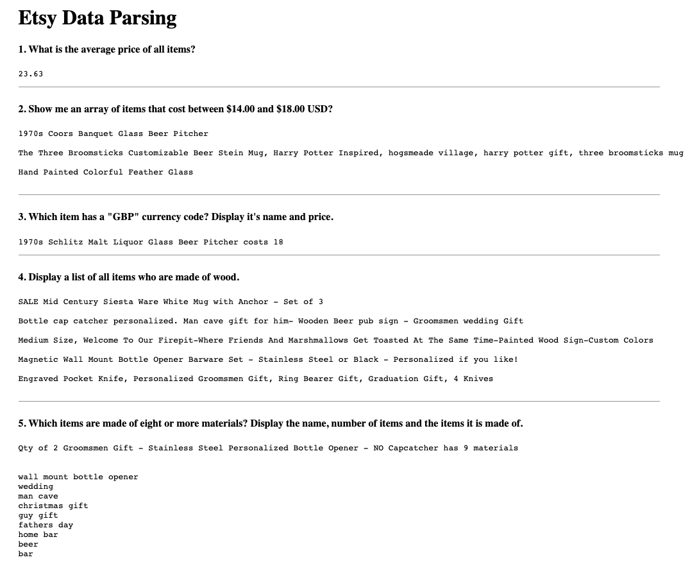

# Using Array Methods To Process Data

## Challenges I Faced? 

Some of these JavaScript concepts to me, can be very esoteric nature. Especially when it comes to Manipulating the HTML or data. Also Github seems like a very robust platform And sometimes I have trouble understanding what's happening from tab to tab. And seeing that I only have one day to learn and complete the assignment can make things quite challenging as well.

## How Did I Over Come Those Challenges? 

By collaborating with my peers I was able to understand and get an overall picture of what I needed to do in order to bring this task to fruition and by doing research on platforms like Google, Github YouTube, MDN docs, Stack Overflow, online courses, and reference guides. I was able to navigate through and complete this assignment.  

## What Did I Learn?

* How to understand objects
* How to understand arrays and loops
* How to be able to breakdown multiple steps into a series of statements in JS
* How to use `array.forEach()`
* How to use `array.map()`
* How to use `array.filter()`
* How to use `array.reduce()`
* How to use use the files `items.js` and `index.html`
* How to create a `main.js` file to put code in
* How to use `innerHTML`,  to place answers in the correct element in the `index.html` file.
* How to deploy to GH Pages

